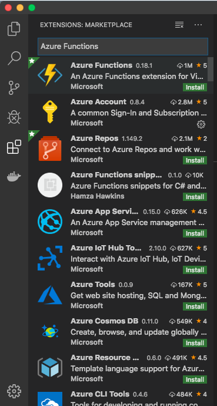

# Azure integration with SAP IAS API

[](https://github.com/pacheco7/sap_ias_azure_function_integration/blob/master/LICENSE)

## Table of contents

1. [Introduction](#introduction)
2. [How to install](#howto-install)
3. [How to use](#howto-use)

## Introduction <a name="introduction"></a>

This project was created for attend a necessity of integrate the Azure AD with SAP Identity Authentication Service, without purchase the SAP Identity Provider service.

## How to install <a name="howto-install"></a>

### Prerequisities:

* Have installed the lastest Visual Studio Code software on your machine;
* Have installed Node (8.0+);
* Have installed Homebrew (MacOS only);
* Have a Developer / Administrator account on Azure;
* Have installed the Azure Functions Core Tools (See the section *_Installation);
* A basic know-how about Azure.

## Installation

### Installing the Visual Studio Code

Open this [link](https://code.visualstudio.com) and follow the instructions to install

### Installing the Node

Open this [link](https://nodejs.org/) and follow the instructions to install.

### Installing Homebrew (MacOS only)

Open this [link](https://docs.brew.sh/Installation) and follow the instructions to install.

### Installing the Azure Functions Core Tools

Windows

```bash
npm i -g azure-functions-core-tools@2
```

MacOS

```bash
brew tap azure/functions
brew install azure-functions-core-tools
```

Linux

1. Set up package feed
    * Ubuntu 18.10

        ```bash
        wget -q https://packages.microsoft.com/config/ubuntu/18.10/packages-microsoft-prod.deb
        sudo dpkg -i packages-microsoft-prod.deb
        ```

    * Ubuntu 18.04

        ```bash
        wget -q https://packages.microsoft.com/config/ubuntu/18.04/packages-microsoft-prod.deb
        sudo dpkg -i packages-microsoft-prod.deb
        ```

    * Ubuntu 16.04 / Linux Mint 18

        ```bash
        wget -q https://packages.microsoft.com/config/ubuntu/16.04/packages-microsoft-prod.deb
        sudo dpkg -i packages-microsoft-prod.deb
        ```

1. Install

    ```bash
    sudo apt-get update
    sudo apt-get install azure-functions-core-tools
    ```
    
### Installing the Azure functions plugin on Visual Studio Code

The next step is install the Azure Functions plugin by the Visual Studio Code Market Place. Go to Extesions button and search for Azure Functions, as bellow:



### Get the code

Clone or download this project on your machine.

## How to use <a name="howto-use"></a>

Access the Azure Functions plugin on the Visual Studio Code (The  icon) next click in the  icon and finally in the button "Open existing project", select the path where you clone or download this source.

Navigate to the API directory and open the "config.json" file, as bellow:


Change the parameters "baseURI" and "Authorization" with:

* baseURI: Put the SAP IAS URI here
* Authorization: Put the crypted authorization key from SAP IAS
